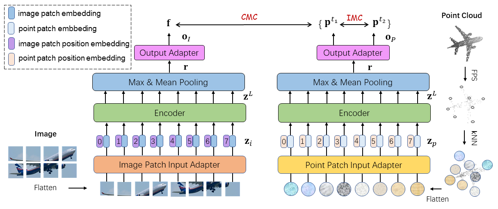
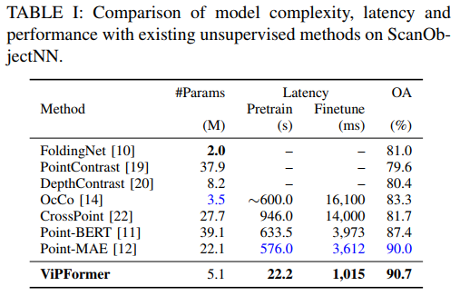
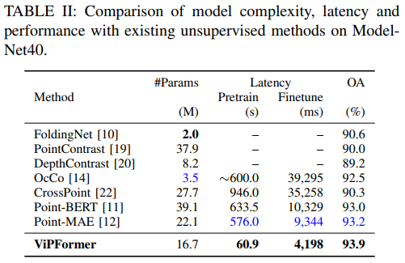
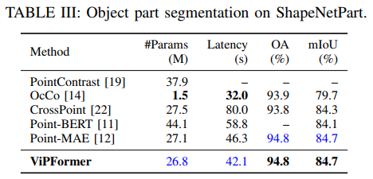
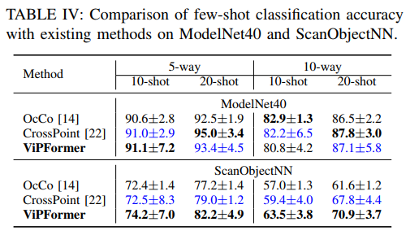
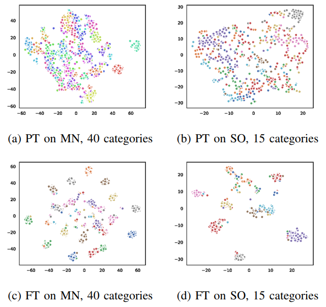
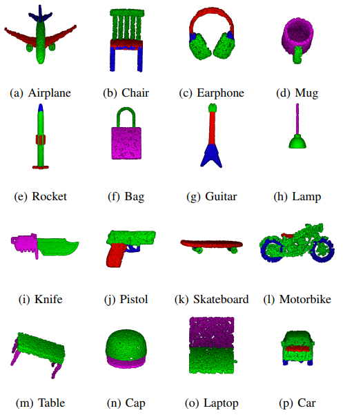
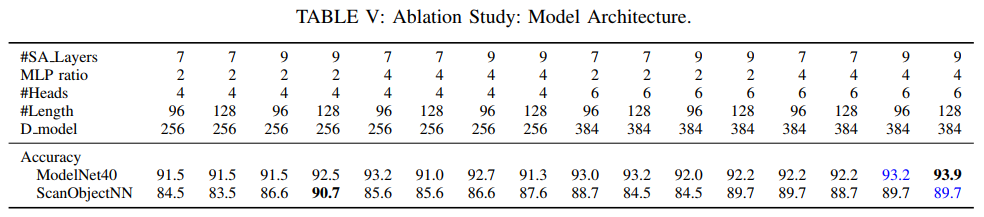
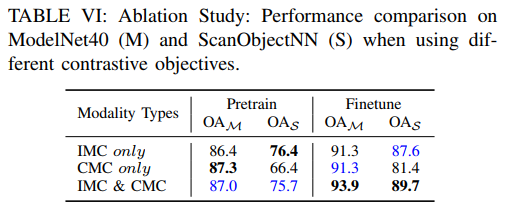
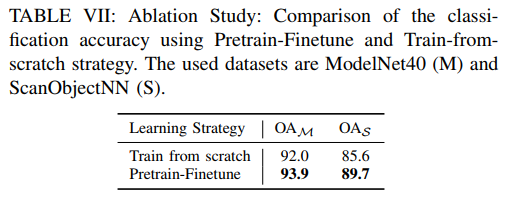

# ViPFormer
This repository is the official implementation of "ViPFormer: Efficient Vision-and-Pointcloud Transformer for Unsupervised Pointcloud Understanding",
created by Hongyu Sun, Yongcai Wang, Xudong Cai, Xuewei Bai and Deying Li. 



Point cloud classification, segmentation and object detection are fundamental tasks in robot perception. 
Recently, a growing number of work design unsupervised paradigms for point cloud processing to alleviate the limitation of 
expensive manual annotation and poor transferability of supervised methods. 
Among them, CrossPoint follows the contrastive learning framework and exploits 
image and point cloud data for unsupervised point cloud understanding. Although the impressive performance is presented, 
the unbalanced architecture makes it unnecessarily complex and inefficient. 
For example, the image branch in CrossPoint is ~8.3x heavier than the point cloud branch leading to higher 
complexity and latency. To address this problem, in this paper, we propose a lightweight Vision-and-Pointcloud Transformer (ViPFormer) 
to unify image and point cloud processing in a single architecture. ViPFormer learns in an unsupervised manner by optimizing 
intra-modal and cross-modal contrastive objectives. Then the pretrained model is transferred to 
various downstream tasks, including 3D shape classification and semantic segmentation. 
Experiments on different datasets show ViPFormer surpasses previous state-of-the-art unsupervised methods with higher accuracy, 
lower model complexity and runtime latency. Finally, the effectiveness of each component in ViPFormer is validated by
extensive ablation studies.

## Preparation
### Package Setup
* Ubuntu 18.04
* Python 3.7.11
* PyTorch 1.11.0
* CUDA 10.2
* torchvision 0.12.0
* wandb 0.12.11
* lightly 1.1.21
* einops 0.4.1
* h5py 3.6.0
* setuptools 59.5.0
* pueue & pueued 2.0.4

```shell
  conda create -n vipformer python=3.7.11
  codna activate vipformer

  pip install torch==1.11.0+cu102 torchvision==0.12.0+cu102 --extra-index-url https://download.pytorch.org/whl/cu102
  pip install -r requirements.txt
```

`pueue` is a shell command management software, we use it for scheduling the model pre-training & fine-tuning tasks, please refer to the [official page](https://github.com/Nukesor/pueue) for installation and basic usage. 
We recommend it because you can run the experiments at scale with this tool thus save your time. 

### W&B Server Setup
We track the model training and fine-tuning with W&B tools. The official W&B tools may be slow and unstable since 
they are on remote servers, we install the local version by running the following command. 

```shell
  docker run --rm -d -v wandb:/vol -p 28282:8080 --name wandb-local wandb/local:0.9.41
```

If you do not have Docker installed on your computer before, referring to the [official document](https://docs.docker.com/engine/install/ubuntu/) to finish Docker installation on Ubuntu.

### Dataset Download
Download the following datasets and extract them to the desired location on your computer. 
1. [ShapeNetRender](https://drive.google.com/file/d/1F9XIhF1qngLt-GtdnOnXiTsXH84YtrbC/view?usp=sharing)
2. [ModelNet40](https://drive.google.com/file/d/15lmtRaHvVIPLOp_o7rms8e6VQp_en8WF/view?usp=sharing)
3. [ScanObjectNN](https://drive.google.com/file/d/15lmtRaHvVIPLOp_o7rms8e6VQp_en8WF/view?usp=sharing)
4. [ShapeNetPart](https://drive.google.com/file/d/15lmtRaHvVIPLOp_o7rms8e6VQp_en8WF/view?usp=sharing)

## Usage
### Pre-train 
1. We pre-train ViPFormer on the ShapeNetRender dataset, which consists of image and point cloud pairs.

2. We provide the different shell files to pre-train ViPFormer with different architectures, for 
example, 

```shell
  ./scripts/pretrain/pt-E1CL6SL-H4D256-L96-MR2-0.sh
```
The filename of shell has specific meaning, `pt` refers to `pre-train`, and `E1CL6SL-H4D256-L96-MR2-0` specifies its architecture with 1 `cross-attention layer`, 6 `self-attention layer`, 4 `attention heads`, `model dimension` of 256, 96 `point or image patches`, `MLP ratio` of 2, and the ending `0` indicates the first run with this architecture. So we can ablate the model architecture by changing these parameters in the shell files. 


### Fine-tune 
1. We fine-tune the pre-trained ViPFormer model on various target datasets, including 
ModelNet40, ScanObjectNN and ShapeNetPart. 

2. We also provide the shell files to fine-tune the pre-trained model, for example, 

```
  ./scripts/finetune/ft-E1CL6SL-H4D256-L96-MR2-0.sh
```
Here `ft` means `fine-tune` and its following string points out the model architecture and corresponding running order.

3. Optionally, you can download our pre-trained models for evaluation.

| Architecture      | Acc. (MN) | ACC. (SO) | Code |
| :----------- | :-----------: | :-----------: | :-----------: |
| [E1CL8SL-H4D256-L128-MR2]( https://pan.baidu.com/s/1669S-tUXOgtdBwMOdoNhcQ?pwd=9wfb) | 92.48 | **90.72** | 9wfb |
| [E1CL8SL-H6D384-L128-MR4](https://pan.baidu.com/s/1zcsOpd2m5MHVr7AicLj9Ug?pwd=v843) | **93.93** | 89.69 | v843 |

### Few-shot Classification
1. The performance of few-shot point cloud classification is tested on two datasets. We follow the `K-way, N-shot` convention to conduct the experiments.

2. We provide the running scripts, for example

```
  ./scripts/fewshot/eval_fewshot-MN.sh
```

In `eval_fewshot-MN.sh`, `MN` represents the ModelNet40 dataset. You can switch `MN` to `SO` to evaluate on ScanObjectNN.

## Results
### Model Complexity, Latency and Performance
#### a) 3D Point Cloud Classification




#### b) 3D Shape Part Segmentation


#### c) Few-shot Point Cloud Classification


### Visualization
#### a) Pre-trained & Fine-tuned Feature Distribution


#### b) 3D Shape Part Segmentation


## Ablation Studies
### a) Model Architecture


### b) Contrastive Objectives


### c) Learning Strategies


## Citation
If you find our paper and codebase are helpful for your research or project, please consider cite ViPFormer as follows.
```bibtex
@inproceedings{sun22vipformer,
  title={ViPFormer: Efficient Vision-and-Pointcloud Transformer for Unsupervised Pointcloud Understanding},
  author={Hongyu Sun, Yongcai Wang, Xudong Cai, Xuewei Bai and Deying Li},
  booktitle={IEEE International Conference on Robotics and Automation (ICRA)},
  year={2023}
}
```

## Acknowledgement
Our implementation and visualization are partially inspired by the following repositories:  
1. [CrossPoint](https://github.com/MohamedAfham/CrossPoint)
2. [PerceiverIO](https://github.com/krasserm/perceiver-io)
3. [PointNet++](https://github.com/yanx27/Pointnet_Pointnet2_pytorch)